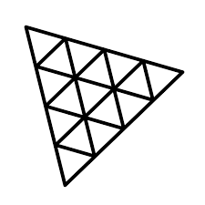

# 💻 Computer scene

This computer scene was created on Blender then was imported in a ThreeJS project.

URL : https://computer-scene-vanilla.vercel.app/


## 🛠 Stack

[](https://nextjs.org/docs)[](https://threejs.org/docs/)[](https://www.blender.org/)

## 👨‍💻 Installation

```bash
git clone https://github.com/mariusSty/computer-scene-vanilla.git
npm install
```

## 🚀 Getting start

```bash
npm run dev
```

Open [http://localhost:5173/](http://localhost:5173/) with your browser to see the result.
